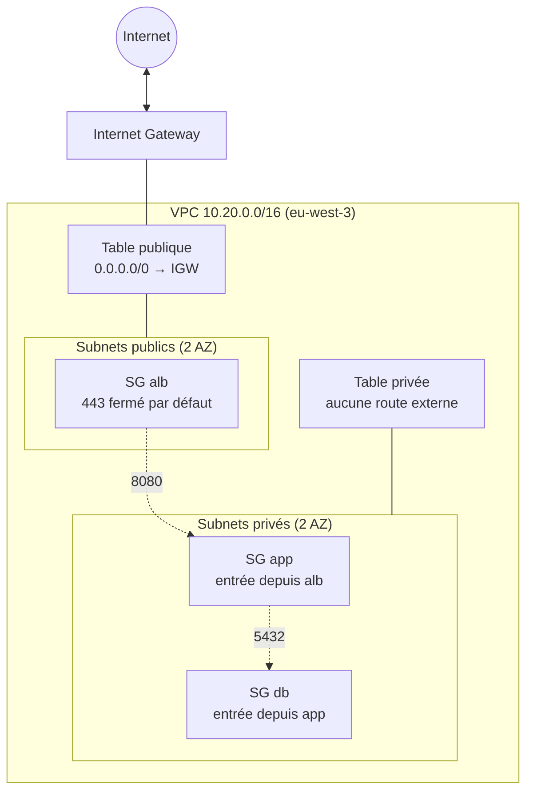

# terraform-aws-secure-network

Réseau AWS sécurisé (VPC, subnets publics/privés, routage, Security Groups) construit avec Terraform, dans une démarche maîtrisée des coûts : aucune ressource facturable n'est créée par défaut, et chaque démonstration payante est suivie d'un nettoyage vérifié.

[](https://github.com/Aliyoub/terraform-aws-secure-network/actions/workflows/terraform-validate.yml)
[](https://github.com/Aliyoub/terraform-aws-secure-network/actions/workflows/terraform-plan.yml)

> **Statut :** phases 1 à 8 terminées. Le réseau complet (`dev` : VPC, subnets, routage, Security Groups) a été déployé sur AWS, prouvé par 10 captures commentées, puis détruit et vérifié indépendamment (principe « capture puis cleanup »). La CI s'authentifie auprès d'AWS par OIDC, sans clé statique. Tests réseau et scénarios de troubleshooting à venir (phases 9-10).

## Vue d'ensemble



Détails complets, plan d'adressage et justifications : [`docs/ARCHITECTURE.md`](docs/ARCHITECTURE.md).

## Ce que démontre le projet

- **Réseau :** VPC `10.20.0.0/16` multi-AZ, subnets publics et privés segmentés par le routage (une route `0.0.0.0/0` vers l'Internet Gateway ne fait un subnet public que si elle existe dans sa table).
- **Sécurité :** Security Groups en chaîne `alb → app → db`, référencés entre eux plutôt que par CIDR, aucun SSH exposé, groupe de sécurité et table de routage par défaut du VPC vidés.
- **Infrastructure as Code :** modules Terraform réutilisables (`vpc`, `subnet`, `route-table`, `security-group`), variables validées, tags cohérents, `.terraform.lock.hcl` commité.
- **Qualité et coûts :** `scripts/validate.sh` (fmt, validate, tflint, garde-fou de coût, recherche de secrets), testé avec des cas défectueux volontaires pour prouver qu'il détecte bien les problèmes.
- **CI :** GitHub Actions exécute les mêmes contrôles à chaque push (`terraform-validate`, sans accès AWS) et un `terraform plan` réel contre le compte (`terraform-plan`), authentifié par OIDC sans aucune clé statique, avec un rôle IAM restreint à ce dépôt et en lecture seule. Actions tierces épinglées sur un SHA de commit, permissions minimales.
- **Démarche :** chaque décision est documentée (ADR), chaque ressource payante potentielle listée avant création, chaque déploiement de démonstration suivi d'un `terraform destroy` vérifié indépendamment de l'état AWS.
- **Diagnostic en conditions réelles :** un incident d'authentification OIDC (claim `sub` rejeté par AWS) a été diagnostiqué par preuve — recherche dans CloudTrail, confirmation par la documentation officielle GitHub, correction minimale, revérification par un nouveau run — plutôt que par supposition. Détail dans l'ADR-017 de `docs/DECISIONS.md`.

## Structure du dépôt

```
terraform/
  modules/               vpc, subnet, route-table, security-group, github-oidc
  environments/dev/      module racine de l'environnement réseau
  environments/bootstrap/ fournisseur OIDC + rôle IAM de la CI (state séparé, ADR-016)
docs/                    architecture, sécurité, décisions (coûts et dépannage à venir)
screenshots/             preuves capturées au fil du projet
scripts/                 validate.sh, check-aws-cost-risk.sh (cleanup.sh à venir)
.github/workflows/       validate (aucun accès AWS) et plan (OIDC, lecture seule). Aucun apply automatique
```

## Documentation

| Document | Contenu |
|---|---|
| [`docs/ARCHITECTURE.md`](docs/ARCHITECTURE.md) | Plan d'adressage, diagrammes, routage, captures commentées |
| [`docs/SECURITY.md`](docs/SECURITY.md) | Security Groups, Security Group vs NACL, arbitrages de sécurité, CI |
| [`docs/DECISIONS.md`](docs/DECISIONS.md) | Décisions d'architecture (ADR), avec leur contexte et leurs conséquences |
| [`docs/COSTS.md`](docs/COSTS.md) | Tarifs AWS vérifiés (`eu-west-3`), niveaux de risque, alternatives moins coûteuses |

## Utilisation

```bash
cd terraform/environments/dev
terraform init
terraform fmt -check
terraform validate

# Rejoue localement les contrôles de la CI (aucun accès AWS)
../../../scripts/validate.sh
```

`terraform apply` n'est jamais exécuté automatiquement.

## Avancement

| Phase | Contenu | État |
|---|---|---|
| 1 | Structure du projet | ✅ |
| 2 | VPC, subnets multi-AZ | ✅ déployé, capturé, détruit |
| 3 | Routage (IGW, tables) | ✅ déployé, capturé, détruit |
| 4 | Security Groups | ✅ déployé, capturé, détruit |
| 5 | Validation locale (tflint, scripts) | ✅ |
| 6 | GitHub Actions (validation) | ✅ |
| 7 | OIDC / IAM | ✅ déployé, preuve capturée (conservé, sert à la CI) |
| 8 | CI authentifiée (`terraform-plan`), déploiement contrôlé | ✅ |
| 9 | Tests réseau | à venir |
| 10 | Troubleshooting | à venir |
| 11 | Extensions optionnelles (NAT, ALB, EC2, RDS...) | à venir |
| 12-13 | Cleanup final, finalisation portfolio | à venir |

Captures disponibles dans [`screenshots/`](screenshots/) : subnets multi-AZ, script de validation, CI, rôle IAM OIDC (permissions et politique de confiance), tables de routage publique/privée, chaîne de Security Groups.

## Auteur

Binaté Aliyou, DevOps / Cloud Engineer.

## Licence

MIT
