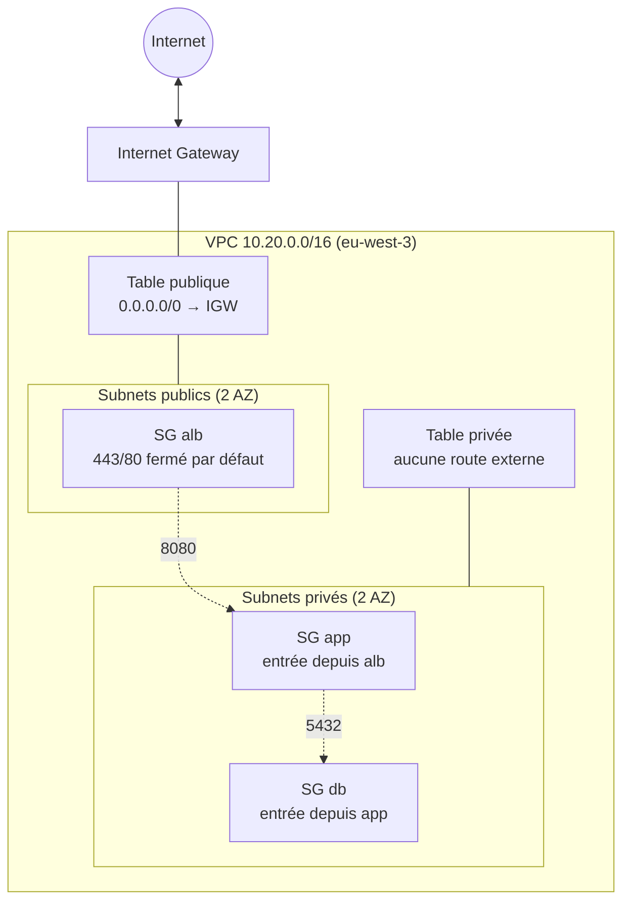

# terraform-aws-secure-network

Réseau AWS sécurisé (VPC, subnets publics/privés, routage, Security Groups) construit avec Terraform, dans une démarche maîtrisée des coûts : aucune ressource facturable n'est créée par défaut, et chaque démonstration payante est suivie d'un nettoyage vérifié.

[](https://github.com/Aliyoub/terraform-aws-secure-network/actions/workflows/terraform-validate.yml)
[](https://github.com/Aliyoub/terraform-aws-secure-network/actions/workflows/terraform-plan.yml)

> **Statut :** projet terminé (phases 1 à 13). Le réseau de base (`dev` : VPC, subnets multi-AZ, routage, Security Groups) a été déployé, prouvé par des captures commentées, testé (isolation réseau, scénarios de troubleshooting reproduits en direct) puis détruit et vérifié indépendamment. Six extensions optionnelles (VPC Endpoints, EC2, NAT Gateway, ALB, RDS, VPC Flow Logs) ont ensuite été déployées progressivement, chacune testée avec une preuve de fonctionnement réelle, puis intégralement détruites lors d'un cleanup final (48 ressources, vérifié indépendamment, résultat CLEAN). La CI s'authentifie auprès d'AWS par OIDC, sans clé statique. Aucune ressource AWS du projet ne reste active à ce jour.

## Vue d'ensemble



Ce socle réseau est ce qui reste déployé par défaut (`enable_... = false` partout). Six extensions optionnelles (NAT Gateway, VPC Endpoints, EC2, ALB, RDS, VPC Flow Logs) ont été démontrées une par une puis détruites : voir [`docs/EXTENSIONS.md`](docs/EXTENSIONS.md). Détails complets, plan d'adressage et justifications : [`docs/ARCHITECTURE.md`](docs/ARCHITECTURE.md).

## Ce que démontre le projet

- **Réseau :** VPC `10.20.0.0/16` multi-AZ, subnets publics et privés segmentés par le routage (une route `0.0.0.0/0` vers l'Internet Gateway ne fait un subnet public que si elle existe dans sa table).
- **Sécurité :** Security Groups en chaîne `alb → app → db`, référencés entre eux plutôt que par CIDR, aucun SSH exposé, groupe de sécurité et table de routage par défaut du VPC vidés.
- **Infrastructure as Code :** modules Terraform réutilisables (`vpc`, `subnet`, `route-table`, `security-group`, `nat-gateway`, `vpc-endpoints`, `ec2-instance`, `alb`, `rds`, `github-oidc`), variables validées, tags cohérents, `.terraform.lock.hcl` commité et verrouillé pour deux plateformes (local + CI).
- **Qualité et coûts :** `scripts/validate.sh` (fmt, validate, tflint, garde-fou de coût structurel, recherche de secrets), testé avec des cas défectueux volontaires pour prouver qu'il détecte bien les problèmes. `scripts/cleanup.sh` formalise, sous forme rejouable, la procédure de destruction contrôlée suivie manuellement tout au long du projet.
- **CI :** GitHub Actions exécute les mêmes contrôles à chaque push (`terraform-validate`, sans accès AWS) et un `terraform plan` réel contre le compte (`terraform-plan`), authentifié par OIDC sans aucune clé statique, avec un rôle IAM restreint à ce dépôt et en lecture seule. Actions tierces épinglées sur un SHA de commit, permissions minimales.
- **Tests réseau :** `scripts/network-isolation-check.sh` interroge le compte AWS réel (pas seulement le code) et a été prouvé capable de détecter une vraie régression volontairement introduite (règle de Security Group dangereuse ajoutée hors Terraform).
- **Extensions payantes maîtrisées :** NAT Gateway, VPC Interface Endpoints, EC2 (administré sans SSH via Session Manager), ALB, RDS PostgreSQL et VPC Flow Logs — chacune déployée, testée avec une preuve réelle (connectivité Internet via NAT, requête HTTP de bout en bout via l'ALB, connexion `psql` réelle à RDS, trafic réel capturé par les Flow Logs), puis détruite. Coût réel de l'ensemble de la démonstration : sous 1 $.
- **Démarche :** chaque décision est documentée (ADR), chaque ressource payante potentielle listée avec une fiche coût avant création, chaque déploiement de démonstration suivi d'un `terraform destroy` vérifié indépendamment de l'état AWS.
- **Diagnostic en conditions réelles :** un incident d'authentification OIDC (claim `sub` rejeté par AWS) a été diagnostiqué par preuve — recherche dans CloudTrail, confirmation par la documentation officielle GitHub, correction minimale, revérification par un nouveau run. Cinq autres scénarios de troubleshooting (dérive de tag, règle de sécurité dangereuse invisible pour `terraform plan`, règle légitime supprimée, route publique supprimée, ressource publique inaccessible) sont reproduits en direct ou raisonnés dans `docs/TROUBLESHOOTING.md`.

## Structure du dépôt

```
terraform/
  modules/               vpc, subnet, route-table, security-group, github-oidc,
                          nat-gateway, vpc-endpoints, ec2-instance, alb, rds
  environments/dev/      module racine de l'environnement réseau (+ extensions optionnelles)
  environments/bootstrap/ fournisseur OIDC + rôle IAM de la CI (state séparé, ADR-016)
docs/                    architecture, sécurité, coûts, troubleshooting, décisions, extensions
screenshots/             preuves capturées au fil du projet
scripts/                 validate.sh, check-aws-cost-risk.sh, network-isolation-check.sh, cleanup.sh
.github/workflows/       validate (aucun accès AWS) et plan (OIDC, lecture seule). Aucun apply automatique
```

## Documentation

| Document | Contenu |
|---|---|
| [`docs/ARCHITECTURE.md`](docs/ARCHITECTURE.md) | Plan d'adressage, diagrammes, routage, captures commentées |
| [`docs/SECURITY.md`](docs/SECURITY.md) | Security Groups, Security Group vs NACL, arbitrages de sécurité, CI, OIDC |
| [`docs/DECISIONS.md`](docs/DECISIONS.md) | Décisions d'architecture (ADR), avec leur contexte et leurs conséquences |
| [`docs/COSTS.md`](docs/COSTS.md) | Tarifs AWS vérifiés (`eu-west-3`), niveaux de risque, alternatives moins coûteuses |
| [`docs/TROUBLESHOOTING.md`](docs/TROUBLESHOOTING.md) | Scénarios de dépannage réels ou reproduits en direct (OIDC, drift Terraform, Security Group, routage) |
| [`docs/EXTENSIONS.md`](docs/EXTENSIONS.md) | Extensions optionnelles (NAT, endpoints, EC2, ALB, RDS, Flow Logs), construites et testées progressivement |

## Utilisation

```bash
cd terraform/environments/dev
terraform init
terraform fmt -check
terraform validate

# Rejoue localement les contrôles de la CI (aucun accès AWS)
../../../scripts/validate.sh

# Vérifie l'isolation réseau réelle sur le compte AWS (lecture seule)
../../../scripts/network-isolation-check.sh
```

`terraform apply` n'est jamais exécuté automatiquement. Si des ressources restent déployées (`terraform state list` non vide dans `dev`), `scripts/cleanup.sh` formalise leur destruction contrôlée : inventaire, plan de destruction, confirmation explicite, puis vérification indépendante par AWS CLI qu'aucune ressource taguée `Project=terraform-aws-secure-network` ne subsiste.

## Avancement

| Phase | Contenu | État |
|---|---|---|
| 1 | Structure du projet | ✅ |
| 2 | VPC, subnets multi-AZ | ✅ déployé, capturé, détruit |
| 3 | Routage (IGW, tables) | ✅ déployé, capturé, détruit |
| 4 | Security Groups | ✅ déployé, capturé, détruit |
| 5 | Validation locale (tflint, scripts) | ✅ |
| 6 | GitHub Actions (validation) | ✅ |
| 7 | OIDC / IAM | ✅ déployé, preuve capturée (conservé, sert à la CI) |
| 8 | CI authentifiée (`terraform-plan`), déploiement contrôlé | ✅ |
| 9 | Tests réseau (`network-isolation-check.sh`) | ✅ |
| 10 | Troubleshooting (6 scénarios) | ✅ |
| 11 | Extensions optionnelles (NAT, endpoints, EC2, ALB, RDS, Flow Logs) | ✅ 6/6 démontrées |
| 12 | Cleanup final (48 ressources) | ✅ vérifié indépendamment, CLEAN |
| 13 | Finalisation du portfolio | ✅ |

Captures disponibles dans [`screenshots/`](screenshots/) : subnets multi-AZ, script de validation, CI, rôle IAM OIDC (permissions et politique de confiance), tables de routage publique/privée, chaîne de Security Groups, test d'isolation réseau, troubleshooting (avant/après), et les six extensions de la Phase 11 (endpoints, Session Manager, connectivité NAT, requête HTTP via l'ALB, connexion RDS, Flow Logs).

## Auteur

Binaté Aliyou, DevOps / Cloud Engineer.

## Licence

MIT
