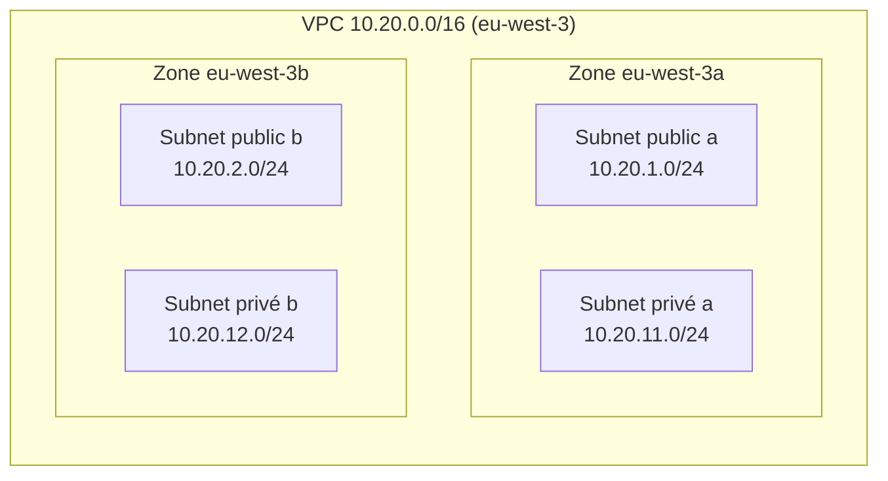
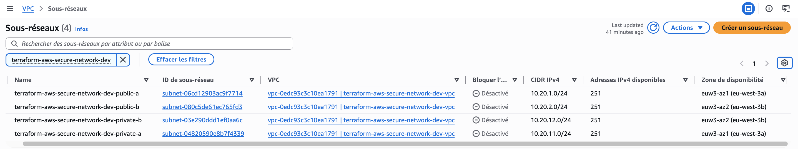
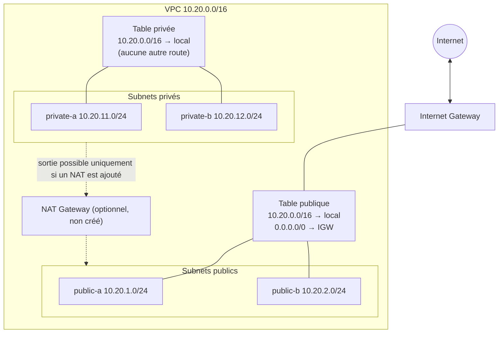
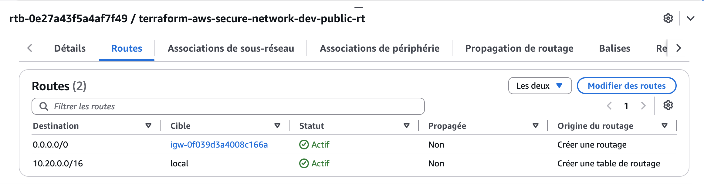
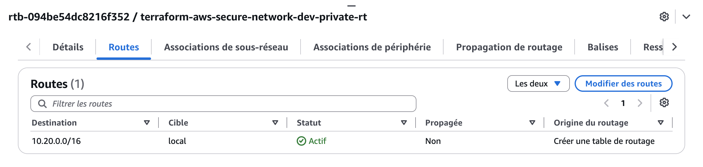
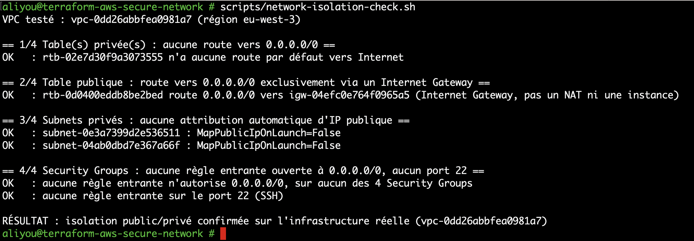

# Architecture réseau

> Document en construction. Cette version couvre la Phase 2 (VPC, CIDR, zones de disponibilité, subnets). Le routage, les Security Groups et le diagramme complet seront ajoutés dans les phases suivantes.

## Vue d'ensemble (Phase 2)

À ce stade, aucun routage n'est configuré : la distinction public/privé n'est donc pas encore effective (voir « Ce qui rend un subnet public » ci-dessous).

## Plan d'adressage

| Élément | CIDR | Adresses | Utilisables (AWS réserve 5 adresses) | Zone |
|---|---|---|---|---|
| VPC | `10.20.0.0/16` | 65 536 | n/a | eu-west-3 |
| Public a | `10.20.1.0/24` | 256 | 251 | eu-west-3a |
| Public b | `10.20.2.0/24` | 256 | 251 | eu-west-3b |
| Privé a | `10.20.11.0/24` | 256 | 251 | eu-west-3a |
| Privé b | `10.20.12.0/24` | 256 | 251 | eu-west-3b |

- **Taille :** un `/16` est le plus grand VPC autorisé par AWS. Il est volontairement large : le réseau ne coûte rien, mais changer le CIDR d'un VPC en production est pénible.
- **Segmentation :** le 3e octet indique le rôle. `1-9` public, `11-19` privé, `21-29` réservé à une future couche données. Un CIDR lisible facilite les règles de Security Group et le diagnostic.
- **Évolutivité :** une 3e zone (`10.20.3.0/24`, `10.20.13.0/24`) et une couche données peuvent s'ajouter sans toucher aux subnets existants.
- **Non-chevauchement :** le compte contient déjà des VPC en `10.0.0.0/16` et `192.168.0.0/16`. `10.20.0.0/16` ne les recouvre pas, ce qui préserve les possibilités de peering (ADR-005).
- **Zones de disponibilité :** deux zones (a et b) suffisent pour démontrer la haute disponibilité. Si une zone tombe, l'autre garde ses subnets. `eu-west-3` en compte trois.

## Ce qui rend un subnet public

Un subnet est public lorsque sa **table de routage** contient une route `0.0.0.0/0` vers un **Internet Gateway**. Ni son nom, ni son tag, ni `map_public_ip_on_launch` n'y changent quelque chose. Un subnet privé n'a pas cette route. En Phase 2, aucun Internet Gateway n'existe encore : les quatre subnets utilisent la table de routage principale du VPC, qui ne contient que la route locale. Les tables dédiées et l'Internet Gateway arrivent en Phase 3.

## Modules

| Module | Rôle |
|---|---|
| `terraform/modules/vpc` | Crée le VPC (DNS activé, tenancy par défaut) |
| `terraform/modules/subnet` | Crée un ensemble de subnets d'un même niveau (public ou privé), un par zone |

## Preuve de déploiement : subnets multi-AZ (Phase 2)

*Console AWS, VPC → Sous-réseaux, filtrée sur `terraform-aws-secure-network-dev`, région `eu-west-3` (Paris).*

**Ce que montre la capture.** Le VPC `terraform-aws-secure-network-dev-vpc` contient exactement quatre subnets, tous dans l'état `Available` :

| Subnet | CIDR | Zone de disponibilité |
|---|---|---|
| `…-public-a` | `10.20.1.0/24` | `euw3-az1` (`eu-west-3a`) |
| `…-public-b` | `10.20.2.0/24` | `euw3-az2` (`eu-west-3b`) |
| `…-private-a` | `10.20.11.0/24` | `euw3-az1` (`eu-west-3a`) |
| `…-private-b` | `10.20.12.0/24` | `euw3-az2` (`eu-west-3b`) |

Chacun expose 251 adresses IPv4 disponibles : un `/24` compte 256 adresses et AWS en réserve 5 (adresse réseau, routeur du VPC, DNS, usage futur, broadcast).

**Pourquoi cette configuration.** Chaque niveau (public et privé) est présent dans les deux zones. Si `eu-west-3a` devient indisponible, les subnets de `eu-west-3b` continuent de fonctionner : c'est ce qui permettra, plus tard, de placer des ressources redondantes dans chaque zone. La console affiche deux identifiants pour une zone : `eu-west-3a` est le nom propre au compte, alors que `euw3-az1` est l'identifiant physique, identique pour tous les comptes. Deux comptes peuvent avoir des noms différents pour la même zone physique, d'où l'intérêt de l'identifiant lorsqu'on compare des comptes.

**Ce que cette capture ne prouve pas encore.** Le nom « public » ou « privé » est une convention de nommage à ce stade. Aucun Internet Gateway n'existe et les quatre subnets utilisent la table de routage principale du VPC, qui ne contient que la route locale. Le caractère public ne viendra que de la table de routage de la Phase 3. La colonne « Bloquer l'accès public » affichée par la console concerne la fonction AWS *VPC Block Public Access*, désactivée par défaut sur le compte ; elle n'est pas un réglage du projet.

**Bonne pratique illustrée.** Un plan d'adressage lisible (`1-9` public, `11-19` privé), des noms et des tags cohérents générés par Terraform, et un déploiement reproductible à partir du code : `terraform plan` prévoyait exactement ces cinq ressources.

## Routage (Phase 3)

### Tables de routage

| Table | Associée à | Routes | Effet |
|---|---|---|---|
| Publique | `public-a`, `public-b` | `10.20.0.0/16` → local, `0.0.0.0/0` → Internet Gateway | Les subnets peuvent joindre Internet et être joints si une IP publique et des règles de sécurité l'autorisent |
| Privée | `private-a`, `private-b` | `10.20.0.0/16` → local | Communication interne au VPC uniquement, aucune sortie Internet |
| Principale du VPC | aucun subnet | `10.20.0.0/16` → local (`route = []`) | Filet de sécurité pour tout subnet non associé (ADR-008) |

### Pourquoi le subnet public est public, et le privé ne l'est pas

Un subnet est public parce que **sa table de routage** contient une route `0.0.0.0/0` vers l'Internet Gateway. La route `10.20.0.0/16 → local` est ajoutée automatiquement par AWS à chaque table : elle permet aux subnets de communiquer entre eux dans le VPC et ne peut pas être supprimée. Les subnets privés n'ont pas de route vers l'IGW, donc aucun trafic ne peut sortir vers Internet ni y être routé. Une sortie Internet pour des ressources privées passerait par un NAT Gateway (qui a un coût), une NAT instance ou des VPC endpoints, qui ne sont pas créés dans cette version.

### Ce que le routage ne suffit pas à garantir

Une route vers l'IGW est nécessaire mais pas suffisante pour exposer une ressource : il faut aussi une IP publique (l'attribution automatique est désactivée, ADR-006) et des règles de Security Group qui autorisent le trafic (Phase 4). Ces trois couches se cumulent.

### Preuve de déploiement : contenu réel des tables de routage

*Console AWS, VPC → Tables de routage → `terraform-aws-secure-network-dev-public-rt`, onglet « Routes ».*

*Même écran, table `terraform-aws-secure-network-dev-private-rt`.*

**Ce que montrent ces deux captures.** La table publique contient 2 routes : `10.20.0.0/16 → local` (ajoutée automatiquement par AWS) et `0.0.0.0/0 → igw-0f039d3a4008c166a`, ajoutée explicitement par le module `route-table`. La table privée n'a que la première : aucune route ne mène en dehors du VPC. C'est la preuve concrète, sur l'infrastructure réellement déployée, de ce que la section précédente décrit en théorie.

**Pourquoi deux captures et non une.** La console AWS n'affiche le contenu des routes que table par table (onglet « Routes » d'une table à la fois) : impossible de montrer les deux contenus dans un seul écran sans monter les images. Deux captures séparées, chacune complète et non retouchée, sont une preuve plus fiable qu'un montage.

## Test d'isolation réseau (Phase 9)

Les captures précédentes montrent la configuration à un instant donné. `scripts/network-isolation-check.sh` va plus loin : c'est un **test rejouable**, qui interroge le compte AWS réel et échoue si l'isolation n'est plus respectée, plutôt qu'une simple relecture visuelle.

*Terminal, exécution de `scripts/network-isolation-check.sh` contre l'environnement `dev` déployé.*

### Ce que vérifie le script

| # | Vérification | Pourquoi |
|---|---|---|
| 1 | Aucune table de routage taguée `private` n'a de route `0.0.0.0/0` | C'est la définition même d'un subnet privé (voir ci-dessus) |
| 2 | La table `public` route `0.0.0.0/0` vers un Internet Gateway (`igw-...`), pas un NAT ni une instance | Une route par défaut n'est sûre que si elle pointe vers la ressource attendue |
| 3 | Les subnets `private` n'attribuent pas d'IP publique automatiquement (`MapPublicIpOnLaunch=False`) | Défense en profondeur avec le point 1 (ADR-006) |
| 4 | Aucun Security Group du VPC n'autorise une entrée depuis `0.0.0.0/0`, et aucun n'ouvre le port 22 | Complète la preuve de routage par la couche pare-feu (Phase 4) |

### Preuve que le test détecte vraiment une régression

Un test qui ne renvoie jamais d'échec ne prouve rien (même principe qu'en Phase 5, ADR-014). Avant cette capture, j'ai ajouté une règle entrante `0.0.0.0/0:22` sur le Security Group `db`, relancé le script, vérifié qu'il détectait les **deux** anomalies (`0.0.0.0/0` et port 22), puis retiré la règle et confirmé avec `terraform plan` qu'aucune dérive ne subsistait (`No changes. Your infrastructure matches the configuration.`). Non vérifié : le comportement de ce script sur un compte avec plusieurs VPC du projet simultanément (il prend le premier VPC taggé trouvé) — situation qui ne se présente pas dans ce projet, mais une limite réelle à connaître avant réutilisation ailleurs.

### Ce que ce test ne couvre pas

Il ne remplace pas un test de connectivité réel (aucune requête réseau n'est émise : c'est une lecture de configuration, pas un `ping` ou un `curl`). Un test de bout en bout demanderait une instance EC2, une ressource payante non déployée par défaut dans ce projet (voir `docs/COSTS.md`).
