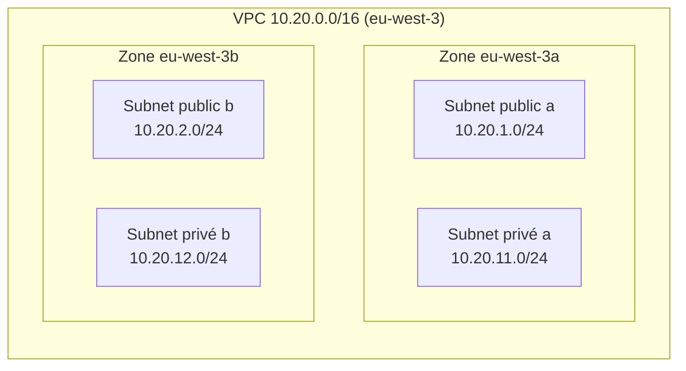

# Architecture réseau

> Document en construction. Cette version couvre la Phase 2 (VPC, CIDR, zones de disponibilité, subnets). Le routage, les Security Groups et le diagramme complet seront ajoutés dans les phases suivantes.

## Vue d'ensemble (Phase 2)

À ce stade, aucun routage n'est configuré : la distinction public/privé n'est donc pas encore effective (voir « Ce qui rend un subnet public » ci-dessous).

## Plan d'adressage

| Élément | CIDR | Adresses | Utilisables (AWS réserve 5 adresses) | Zone |
|---|---|---|---|---|
| VPC | `10.20.0.0/16` | 65 536 | n/a | eu-west-3 |
| Public a | `10.20.1.0/24` | 256 | 251 | eu-west-3a |
| Public b | `10.20.2.0/24` | 256 | 251 | eu-west-3b |
| Privé a | `10.20.11.0/24` | 256 | 251 | eu-west-3a |
| Privé b | `10.20.12.0/24` | 256 | 251 | eu-west-3b |

- **Taille :** un `/16` est le plus grand VPC autorisé par AWS. Il est volontairement large : le réseau ne coûte rien, mais changer le CIDR d'un VPC en production est pénible.
- **Segmentation :** le 3e octet indique le rôle. `1-9` public, `11-19` privé, `21-29` réservé à une future couche données. Un CIDR lisible facilite les règles de Security Group et le diagnostic.
- **Évolutivité :** une 3e zone (`10.20.3.0/24`, `10.20.13.0/24`) et une couche données peuvent s'ajouter sans toucher aux subnets existants.
- **Non-chevauchement :** le compte contient déjà des VPC en `10.0.0.0/16` et `192.168.0.0/16`. `10.20.0.0/16` ne les recouvre pas, ce qui préserve les possibilités de peering (ADR-005).
- **Zones de disponibilité :** deux zones (a et b) suffisent pour démontrer la haute disponibilité. Si une zone tombe, l'autre garde ses subnets. `eu-west-3` en compte trois.

## Ce qui rend un subnet public

Un subnet est public lorsque sa **table de routage** contient une route `0.0.0.0/0` vers un **Internet Gateway**. Ni son nom, ni son tag, ni `map_public_ip_on_launch` n'y changent quelque chose. Un subnet privé n'a pas cette route. En Phase 2, aucun Internet Gateway n'existe encore : les quatre subnets utilisent la table de routage principale du VPC, qui ne contient que la route locale. Les tables dédiées et l'Internet Gateway arrivent en Phase 3.

## Modules

| Module | Rôle |
|---|---|
| `terraform/modules/vpc` | Crée le VPC (DNS activé, tenancy par défaut) |
| `terraform/modules/subnet` | Crée un ensemble de subnets d'un même niveau (public ou privé), un par zone |

## Preuve de déploiement : subnets multi-AZ (Phase 2)

*Console AWS, VPC → Sous-réseaux, filtrée sur `terraform-aws-secure-network-dev`, région `eu-west-3` (Paris).*

**Ce que montre la capture.** Le VPC `terraform-aws-secure-network-dev-vpc` contient exactement quatre subnets, tous dans l'état `Available` :

| Subnet | CIDR | Zone de disponibilité |
|---|---|---|
| `…-public-a` | `10.20.1.0/24` | `euw3-az1` (`eu-west-3a`) |
| `…-public-b` | `10.20.2.0/24` | `euw3-az2` (`eu-west-3b`) |
| `…-private-a` | `10.20.11.0/24` | `euw3-az1` (`eu-west-3a`) |
| `…-private-b` | `10.20.12.0/24` | `euw3-az2` (`eu-west-3b`) |

Chacun expose 251 adresses IPv4 disponibles : un `/24` compte 256 adresses et AWS en réserve 5 (adresse réseau, routeur du VPC, DNS, usage futur, broadcast).

**Pourquoi cette configuration.** Chaque niveau (public et privé) est présent dans les deux zones. Si `eu-west-3a` devient indisponible, les subnets de `eu-west-3b` continuent de fonctionner : c'est ce qui permettra, plus tard, de placer des ressources redondantes dans chaque zone. La console affiche deux identifiants pour une zone : `eu-west-3a` est le nom propre au compte, alors que `euw3-az1` est l'identifiant physique, identique pour tous les comptes. Deux comptes peuvent avoir des noms différents pour la même zone physique, d'où l'intérêt de l'identifiant lorsqu'on compare des comptes.

**Ce que cette capture ne prouve pas encore.** Le nom « public » ou « privé » est une convention de nommage à ce stade. Aucun Internet Gateway n'existe et les quatre subnets utilisent la table de routage principale du VPC, qui ne contient que la route locale. Le caractère public ne viendra que de la table de routage de la Phase 3. La colonne « Bloquer l'accès public » affichée par la console concerne la fonction AWS *VPC Block Public Access*, désactivée par défaut sur le compte ; elle n'est pas un réglage du projet.

**Bonne pratique illustrée.** Un plan d'adressage lisible (`1-9` public, `11-19` privé), des noms et des tags cohérents générés par Terraform, et un déploiement reproductible à partir du code : `terraform plan` prévoyait exactement ces cinq ressources.
