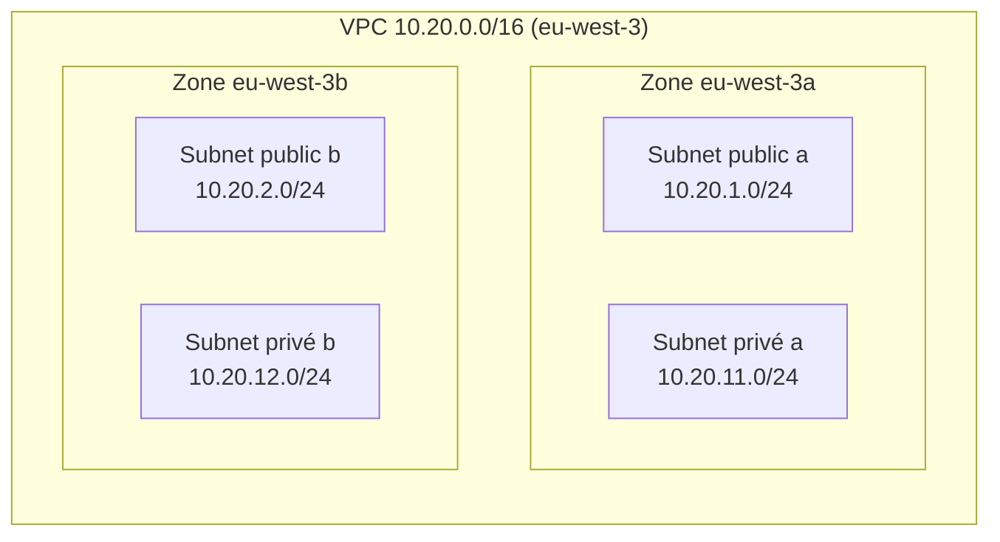

# Architecture réseau

> Document en construction. Cette version couvre la Phase 2 (VPC, CIDR, zones de disponibilité, subnets). Le routage, les Security Groups et le diagramme complet seront ajoutés dans les phases suivantes.

## Vue d'ensemble (Phase 2)

À ce stade, aucun routage n'est configuré : la distinction public/privé n'est donc pas encore effective (voir « Ce qui rend un subnet public » ci-dessous).

## Plan d'adressage

| Élément | CIDR | Adresses | Utilisables (AWS réserve 5 adresses) | Zone |
|---|---|---|---|---|
| VPC | `10.20.0.0/16` | 65 536 | n/a | eu-west-3 |
| Public a | `10.20.1.0/24` | 256 | 251 | eu-west-3a |
| Public b | `10.20.2.0/24` | 256 | 251 | eu-west-3b |
| Privé a | `10.20.11.0/24` | 256 | 251 | eu-west-3a |
| Privé b | `10.20.12.0/24` | 256 | 251 | eu-west-3b |

- **Taille :** un `/16` est le plus grand VPC autorisé par AWS. Il est volontairement large : le réseau ne coûte rien, mais changer le CIDR d'un VPC en production est pénible.
- **Segmentation :** le 3e octet indique le rôle. `1-9` public, `11-19` privé, `21-29` réservé à une future couche données. Un CIDR lisible facilite les règles de Security Group et le diagnostic.
- **Évolutivité :** une 3e zone (`10.20.3.0/24`, `10.20.13.0/24`) et une couche données peuvent s'ajouter sans toucher aux subnets existants.
- **Non-chevauchement :** le compte contient déjà des VPC en `10.0.0.0/16` et `192.168.0.0/16`. `10.20.0.0/16` ne les recouvre pas, ce qui préserve les possibilités de peering (ADR-005).
- **Zones de disponibilité :** deux zones (a et b) suffisent pour démontrer la haute disponibilité. Si une zone tombe, l'autre garde ses subnets. `eu-west-3` en compte trois.

## Ce qui rend un subnet public

Un subnet est public lorsque sa **table de routage** contient une route `0.0.0.0/0` vers un **Internet Gateway**. Ni son nom, ni son tag, ni `map_public_ip_on_launch` n'y changent quelque chose. Un subnet privé n'a pas cette route. En Phase 2, aucun Internet Gateway n'existe encore : les quatre subnets utilisent la table de routage principale du VPC, qui ne contient que la route locale. Les tables dédiées et l'Internet Gateway arrivent en Phase 3.

## Modules

| Module | Rôle |
|---|---|
| `terraform/modules/vpc` | Crée le VPC (DNS activé, tenancy par défaut) |
| `terraform/modules/subnet` | Crée un ensemble de subnets d'un même niveau (public ou privé), un par zone |
