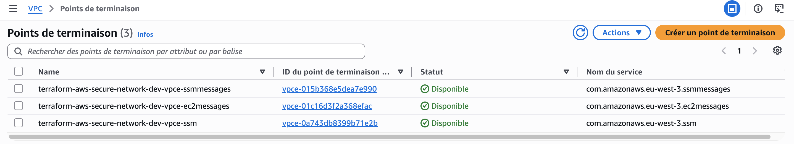
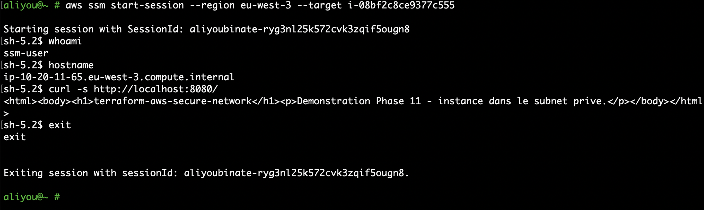
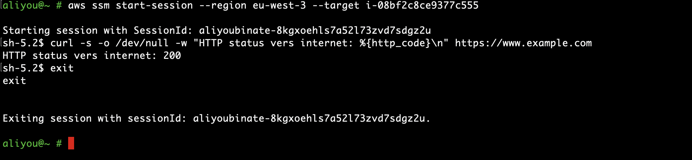

# Extensions (Phase 11)

Six extensions optionnelles, toutes désactivées par défaut (`var.enable_...` dans `terraform/environments/dev`, voir ADR-019). Construites progressivement, chacune ajoutée par-dessus la précédente, avec un test réel à chaque étape plutôt qu'une simple création. Coûts vérifiés dans `docs/COSTS.md`. Un seul cleanup final après les 6 démonstrations.

## Étape 1/6 : VPC Interface Endpoints

*Console AWS, VPC → Points de terminaison.*

**Ce que ça déploie.** Trois VPC Interface Endpoints (`ssm`, `ssmmessages`, `ec2messages`), chacun dans les deux subnets privés, protégés par un Security Group dédié qui n'autorise le HTTPS (443) que depuis le CIDR du VPC. Une règle de sortie a été ajoutée sur le groupe `app` vers ce nouveau Security Group.

**Pourquoi ces trois services précisément.** Systems Manager Session Manager (l'administration sans SSH, ADR-011) a besoin des trois pour fonctionner depuis un subnet privé sans NAT : `ssm` pour le service lui-même, `ssmmessages` et `ec2messages` pour les canaux de communication de l'agent SSM installé sur l'instance.

**Ce que cette étape ne prouve pas encore.** Aucune instance n'existe pour l'instant : ces endpoints sont prêts, mais rien ne les utilise. La preuve d'usage réel vient à l'étape 2.

**Coût :** 0,011 $/heure par endpoint × 3 = 0,033 $/heure, plus 0,01 $/Go traité (négligeable pour cette démonstration).

## Étape 2/6 : EC2 (administration sans SSH)

*Terminal, `aws ssm start-session --target i-08bf2c8ce9377c555`.*

**Ce que ça déploie.** Une instance `t3.micro` (Amazon Linux 2023) dans le subnet privé, sans clé SSH (`key_name = null`), avec IMDSv2 imposé, un rôle IAM dédié (`AmazonSSMManagedInstanceCore`) distinct du rôle OIDC de la CI (Phase 7). Un script `user_data` lance un petit serveur HTTP sur le port 8080, qui servira de cible à l'ALB (étape 4).

**Ce que la capture prouve.** Une vraie session shell, ouverte sans SSH ni IP publique, en s'appuyant sur les VPC Endpoints de l'étape 1 : `whoami` (`ssm-user`), `hostname` (confirme l'instance), et `curl http://localhost:8080/` qui renvoie le contenu posé par `user_data` — le serveur de démonstration fonctionne déjà.

**Un vrai bug d'API trouvé et corrigé.** Le premier `terraform apply` a échoué à la création de l'instance : `InvalidBlockDeviceMapping: Volume of size 8GB is smaller than snapshot ... expect size >= 30GB`. L'AMI Amazon Linux 2023 la plus récente exige un volume racine d'au moins 30 Go. Ni `terraform validate` ni `terraform plan` n'avaient détecté cette contrainte : elle n'apparaît qu'au moment de l'appel réel `RunInstances`. Corrigé en portant `root_volume_size` à 30 (variable dédiée dans le module `ec2-instance`, avec une validation qui l'impose). Les 3 ressources IAM déjà créées lors du premier essai n'ont pas eu besoin d'être recréées : `terraform apply` n'a rejoué que la ressource manquante.

**Coût :** 0,0118 $/heure pour l'instance, plus le stockage EBS (30 Go × 0,0928 $/Go-mois, négligeable pour la durée du test). Le rôle IAM est gratuit.

## Étape 3/6 : NAT Gateway

*Terminal, même instance qu'à l'étape 2, `curl https://www.example.com`.*

**Ce que ça déploie.** Un NAT Gateway (Elastic IP `15.224.130.190`) dans le subnet public `a`, et une route ajoutée à la table privée : `0.0.0.0/0 → nat-0d6398254376377d2`. Une règle de sortie HTTPS a été ajoutée sur le groupe `app` vers `0.0.0.0/0`, explicitement, uniquement pour ce test (voir ADR-019).

**Ce que la capture prouve.** La même instance qu'à l'étape 2, dans le même subnet privé, avec la même configuration réseau à l'exception de cette nouvelle route, peut désormais joindre Internet : `curl` renvoie `200`. Avant cette étape, aucune route de sortie n'existait sur la table privée (vérifié en Phases 9 et 10 avec `scripts/network-isolation-check.sh`) : la même requête aurait échoué.

**Pourquoi c'est la preuve la plus significative de la Phase 9/11.** La Phase 9 avait explicitement écarté ce test faute d'instance EC2. C'est la première preuve de connectivité réelle (pas seulement une lecture de configuration) de tout le projet.

**Coût :** 0,05 $/heure (NAT) + 0,005 $/heure (EIP) + 0,05 $/Go traité (trafic négligeable pour ce test).
