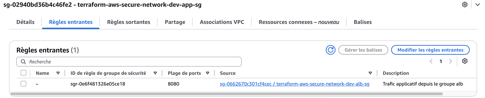
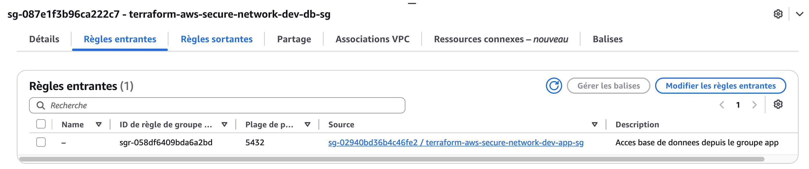
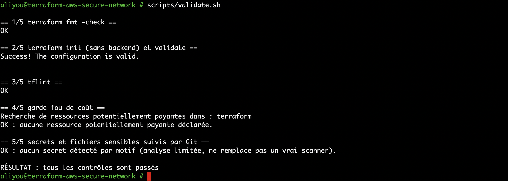
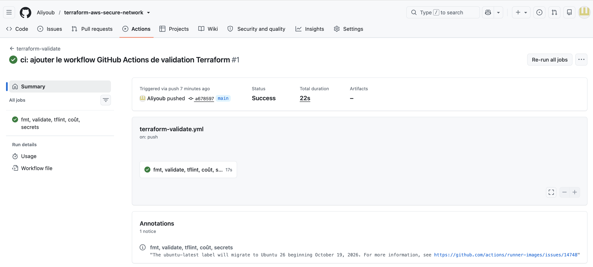
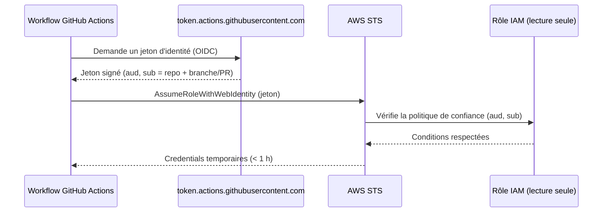
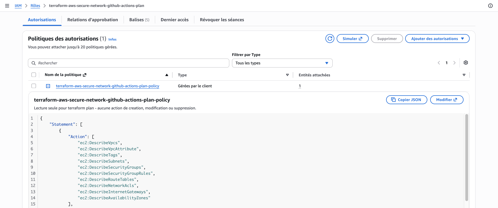
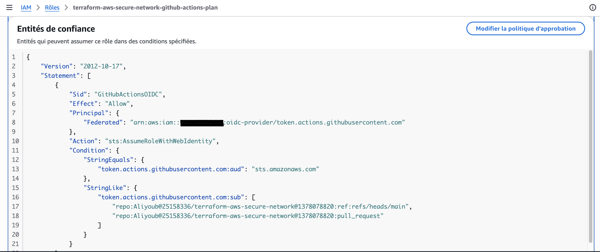

# Sécurité

> Document en construction. Cette version couvre les Security Groups et l'isolation réseau (Phases 3 et 4). L'authentification de la CI (OIDC), les permissions IAM et la chaîne d'approvisionnement seront ajoutées avec les phases correspondantes.

## Principes

- **Moindre privilège :** rien n'est ouvert par défaut ; chaque règle est explicite et justifiée.
- **Défense en profondeur :** trois couches se cumulent pour exposer une ressource : la route vers l'Internet Gateway, une IP publique, et un Security Group qui autorise le trafic (voir `ARCHITECTURE.md`).
- **Sûr par défaut :** la table de routage principale et le groupe de sécurité par défaut du VPC sont gérés et vides (ADR-008, ADR-012).

## Security Groups

Les groupes forment une chaîne `alb -> app -> db`. Un **Security Group est stateful** : la réponse à une connexion autorisée est acceptée automatiquement, sans règle pour le retour.

| Groupe | Entrant | Sortant | Justification |
|---|---|---|---|
| `alb` | HTTPS (443) depuis les CIDR de `alb_allowed_https_cidrs` : **aucun par défaut** | Port applicatif (8080) vers le groupe `app` | Point d'entrée public optionnel, fermé tant qu'on ne l'ouvre pas |
| `app` | Port applicatif (8080) **depuis le groupe `alb` uniquement** | Port base de données (5432) vers le groupe `db` | L'application n'est joignable que par le load balancer |
| `db` | Port base de données (5432) **depuis le groupe `app` uniquement** | **Aucun** | La base ne reçoit que de l'application et n'initie aucune connexion |
| défaut du VPC | Aucun | Aucun | Une ressource sans groupe explicite n'a aucun accès réseau |

- **Références plutôt que CIDR :** une règle du type « depuis le groupe `alb` » suit les ressources, pas leurs adresses. Elle reste correcte si les IP changent et ne peut pas être élargie par erreur à un réseau entier.
- **Aucun SSH :** aucune règle sur le port 22. Le module refuse à la validation tout SSH ou RDP ouvert à `0.0.0.0/0` et toute règle entrante « tous protocoles » (ADR-011).
- **Administration :** AWS Systems Manager Session Manager, sans port entrant ni clé SSH. Il nécessite des VPC endpoints pour un subnet privé sans NAT (coût à évaluer en Phase 11).
- **Sorties restreintes :** l'usage habituel d'un `0.0.0.0/0` en sortie est volontairement absent. Sans NAT, un subnet privé n'a de toute façon aucune route vers Internet ; les règles sortantes limitent en plus le trafic *interne*.

### Preuve de déploiement : la chaîne par référence, pas par CIDR

*Console AWS, groupe `terraform-aws-secure-network-dev-app-sg`, onglet « Règles entrantes ».*

*Groupe `terraform-aws-secure-network-dev-db-sg`, onglet « Règles entrantes ».*

**Ce que montrent ces deux captures.** Dans les deux cas, la colonne « Source » contient un **autre Security Group** (`sg-0662670c301cf4cec / ...-alb-sg` pour `app`, `sg-02940bd36b4c46fe2 / ...-app-sg` pour `db`) et non une plage d'adresses IP. La chaîne complète est ainsi prouvée sur l'infrastructure réellement déployée : `alb` (443, fermé par défaut) → `app` (8080, uniquement depuis `alb`) → `db` (5432, uniquement depuis `app`). Aucun maillon n'accepte de trafic depuis `0.0.0.0/0`, et aucune règle sur le port 22 n'existe nulle part dans ce projet (vérifié par `scripts/check-aws-cost-risk.sh` et par relecture manuelle de ces captures).

**Pourquoi c'est plus robuste qu'un CIDR.** Si l'adresse IP d'une ressource du groupe `alb` change, la règle reste valide : elle référence le groupe, pas une adresse. À l'inverse, elle ne peut jamais être élargie par erreur à un sous-réseau entier.

## Security Group ou Network ACL ?

| | Security Group | Network ACL |
|---|---|---|
| Niveau | Interface réseau (ressource) | Subnet |
| État | **Stateful** (retour automatique) | **Stateless** (retour à autoriser, ports éphémères 1024-65535) |
| Règles | Autorisation uniquement | Autorisation **et** refus, évaluées par numéro |
| Référence à un autre groupe | Oui | Non (CIDR uniquement) |
| Usage dans ce projet | Segmentation principale | Non personnalisée (NACL par défaut conservée) |

Une NACL personnalisée n'apporte pas ici de bénéfice qui justifie sa complexité. Elle deviendrait pertinente pour bloquer explicitement une plage d'adresses, ce qu'un Security Group ne sait pas faire (ADR-012).

## Security trade-offs

| Choix | Bénéfice | Compromis accepté |
|---|---|---|
| Aucun accès Internet sortant depuis les subnets privés | Pas d'exfiltration ni de sortie non maîtrisée, pas de coût NAT | Les ressources privées ne peuvent pas atteindre Internet ni les API AWS sans NAT ou endpoints |
| Aucun SSH | Surface d'attaque réduite, pas de clés à gérer | Dépend de Session Manager, donc d'endpoints payants pour un subnet privé |
| Pas de NACL personnalisée | Simplicité, moins d'erreurs possibles | Pas de blocage explicite d'adresses au niveau subnet |
| Groupes `alb` et `db` créés sans ressource associée | Modèle d'accès documenté et prêt | Groupes inutilisés tant que l'ALB et la base ne sont pas déployés |
| State Terraform local | Pas de bucket à sécuriser à ce stade | Pas de verrouillage ni de partage (ADR-003) |

## Contrôles avant commit

*Terminal, exécution de `scripts/validate.sh` à la racine du dépôt.*

**Ce que montre la capture.** Le script enchaîne cinq contrôles, tous en `OK`, puis affiche « tous les contrôles sont passés » :

| Étape | Contrôle | Ce qu'il évite |
|---|---|---|
| 1 | `terraform fmt -check` | Un formatage incohérent qui pollue les revues de code |
| 2 | `terraform init -backend=false` puis `validate` | Une configuration invalide ou incohérente |
| 3 | `tflint` (règles Terraform et AWS) | Des erreurs de fond que `validate` ne voit pas : valeur refusée par AWS, variable inutilisée, module non épinglé |
| 4 | Garde-fou de coût | L'ajout accidentel d'une ressource payante (NAT Gateway, Elastic IP, load balancer, instance, base, etc.) |
| 5 | Recherche de secrets | Un fichier de state, un `.tfvars`, une clé privée ou une clé d'accès AWS suivis par Git |

**Pourquoi cette configuration.** Ces contrôles ne font aucun appel AWS et ne créent aucune ressource : ils peuvent être rejoués sans risque de coût, à chaque commit, et par la CI. Le garde-fou de coût rend visible toute ressource facturable dès la revue du code, avant même un `plan`. L'analyse de `tflint` complète `validate`, qui n'avait pas détecté l'usage d'une fonction inexistante (ADR-007).

**Ce que ce script ne garantit pas.** La recherche de secrets ne repose que sur quelques motifs (clé d'accès AWS, clé secrète, clé privée) : elle ne remplace pas un véritable scanner. Le garde-fou de coût est une analyse statique du code : il ne vérifie ni les tarifs ni ce qui existe réellement sur le compte. Un `terraform plan` reste nécessaire avant tout déploiement.

**Bonne pratique illustrée.** Des contrôles automatisés et reproductibles « à gauche » (avant le commit) plutôt qu'une découverte tardive en production, et des contrôles eux-mêmes testés avec des cas défectueux pour prouver qu'ils échouent quand il le faut (ADR-014).

## GitHub Actions : permissions et chaîne d'approvisionnement

Le workflow `terraform-validate` applique ces règles (ADR-015) :

| Mesure | Effet |
|---|---|
| `permissions: contents: read` | Le jeton du workflow ne peut que lire le code : il ne peut ni pousser, ni modifier les pull requests, ni créer de release |
| Aucun secret, aucun accès AWS | Un workflow compromis ne peut ni créer, ni lire de ressources AWS |
| `persist-credentials: false` | Le jeton n'est pas laissé dans la configuration Git du runner |
| Actions épinglées sur un SHA de commit | Une action tierce dont le tag serait détourné ne peut pas injecter de code dans la CI |
| Versions de Terraform et de tflint fixées | Les mêmes règles s'appliquent à chaque exécution |
| `terraform init -lockfile=readonly` | Le provider ne peut pas changer sans modification visible de `.terraform.lock.hcl` |
| Aucun `terraform apply` | La CI ne peut rien déployer |

**Limite :** l'épinglage par SHA protège contre le déplacement d'un tag, pas contre une action déjà malveillante au moment où on l'épingle. Le SHA doit être relu à chaque mise à jour.

### Preuve d'exécution

*GitHub, onglet Actions, run déclenché par le push du commit `a678597` sur `main`.*

**Ce que montre la capture.** Le run passe en `Success`, en 22 secondes, avec un seul job (`fmt, validate, tflint, coût, secrets`) réussi en 17 secondes. Une annotation informative de GitHub signale la migration future du runner `ubuntu-latest` vers Ubuntu 26 : elle ne concerne pas le code du projet et ne demande aucune action immédiate.

**Pourquoi cette preuve est importante.** Un script qui réussit en local (`screenshots/02-validate-script.png`) ne garantit pas qu'il réussit dans l'environnement propre et isolé d'une CI, où rien n'est présent par défaut (pas de `.terraform/`, pas de cache). Ce run confirme que la CI installe elle-même Terraform et tflint, puis exécute les mêmes contrôles, sans intervention manuelle.

## OIDC : authentification de la CI sans clé statique

`terraform/environments/bootstrap/` crée, une fois et à la main, ce que la CI utilisera ensuite pour s'authentifier :

**Pourquoi OIDC plutôt qu'une clé d'accès AWS stockée dans GitHub.** Une clé statique ne périme jamais d'elle-même, se fuite facilement (secret GitHub mal configuré, log, fork) et donne le même accès à quiconque la possède. Un jeton OIDC est émis à la demande, expire en moins d'une heure, et n'existe que pour le job qui l'a demandé.

**Ce que vérifie la politique de confiance du rôle.**

| Condition | Valeur exigée | Empêche |
|---|---|---|
| `aud` (audience) | `sts.amazonaws.com` | Un jeton émis pour un autre service d'endosser ce rôle |
| `sub` (sujet) | `repo:Aliyoub@25158336/terraform-aws-secure-network@1378078820:ref:refs/heads/main` ou `...:pull_request` | Un fork ou un autre dépôt d'endosser ce rôle, même en connaissant son ARN |

Le `sub` inclut les identifiants immuables du compte et du dépôt (`@25158336`, `@1378078820`) : GitHub les ajoute par défaut pour tout dépôt créé après le 15/07/2026, ce qui protège en plus contre un renommage ou un transfert du dépôt. Voir l'incident documenté en ADR-017.

L'ARN du rôle n'est pas un secret : seule une organisation GitHub qui contrôle ce dépôt précis peut produire un jeton dont le `sub` correspond.

**Ce que peut faire le rôle, et ce qu'il ne peut pas faire.** Sa politique de permissions ne contient que des actions `ec2:Describe*`, limitées aux types de ressources actuellement définis dans ce projet (ADR-017). Aucune action de création, modification ou suppression. Il ne peut donc jamais servir à un `apply` : c'est une limite technique, pas seulement une convention du workflow.

**Bootstrap : un paradoxe de démarrage assumé.** Le fournisseur OIDC et le rôle ne peuvent pas être créés par la CI elle-même, puisqu'elle n'a pas encore d'accès avant leur existence. Ils sont donc appliqués une fois, à la main, avec un accès humain déjà privilégié (ADR-016). C'est la pratique normale : un humain autorisé met en place un accès machine restreint, jamais l'inverse.

### Preuve de déploiement

*Console AWS, IAM → Rôles → `terraform-aws-secure-network-github-actions-plan`, onglet « Autorisations ».*

*Même rôle, onglet « Relations d'approbation ». L'ID de compte AWS a été masqué avant publication.*

**Ce que montrent ces captures.** Le rôle n'a qu'une seule politique attachée (`...-plan-policy`), qui n'autorise que des actions `ec2:Describe*` : aucune création, modification ou suppression n'est possible avec ce rôle, quelle que soit la façon dont il serait détourné. Sa politique de confiance montre les deux conditions qui protègent son usage : `aud` vérifie que le jeton a été émis pour AWS STS, et `sub` le restreint au dépôt `Aliyoub/terraform-aws-secure-network` (identifié par ses identifiants immuables), sur la branche `main` ou pour une pull request de ce dépôt. La capture 06 correspond à la politique corrigée après l'incident de l'ADR-017 ; une première version, restreinte au format simple `owner/repo`, avait empêché tout run d'aboutir.

**Pourquoi l'ID de compte est masqué.** Il n'est pas un secret exploitable seul (ce n'est ni une clé d'accès ni un mot de passe), mais il facilite le repérage et le ciblage d'un compte. Il est masqué dans les captures publiées par précaution, alors que le reste de la politique — sans valeur d'identification à lui seul — reste lisible.

**Ce que ces captures prouvent ensemble.** Le fournisseur OIDC et le rôle existent réellement sur le compte AWS (et non seulement dans le code Terraform), avec exactement les restrictions décrites dans `ARCHITECTURE.md` et les ADR 016-017 : lecture seule, dépôt unique, aucune clé statique.

## `terraform-plan.yml` : ce qu'il prouve, ce qu'il ne prouve pas

Contrairement à `terraform-validate` (Phase 6), ce workflow authentifie la CI auprès d'AWS via OIDC pour exécuter un `terraform plan` réel sur `dev`.

**Ce qu'il apporte réellement.** Le state étant local et non partagé avec la CI (ADR-003, ADR-018), ce plan repart toujours d'un état vide : il affichera "N ressources à créer" même si elles existent déjà sur AWS. Ce n'est donc pas un outil de détection de dérive. Sa valeur est ailleurs : il confirme que la configuration reste réellement déployable dans le compte et la région ciblés (résolution de `data "aws_availability_zones"`, permissions suffisantes, aucune erreur côté API), ce qu'un `validate` local, purement syntaxique, ne peut pas garantir.

**Garde-fous appliqués :**

| Mesure | Effet |
|---|---|
| Permissions du job : `contents: read`, `id-token: write` uniquement | Aucun droit d'écriture sur le dépôt ; le jeton OIDC n'est obtenu que pour ce job |
| `if: ... head.repo.full_name == github.repository` | Une pull request depuis un fork ne peut jamais assumer le rôle AWS, en plus de la restriction `sub` de la politique de confiance (double protection) |
| `mask-aws-account-id: true` | L'ID de compte AWS est masqué dans les logs du workflow |
| ARN du rôle en variable de dépôt (`vars.AWS_OIDC_PLAN_ROLE_ARN`) | Le code du workflow ne dépend pas d'une valeur d'infrastructure codée en dur |
| Aucun `terraform apply` | Ce workflow ne peut toujours rien déployer ni modifier |

**Pour une vraie détection de dérive**, il faudrait un backend distant partagé (S3 avec verrouillage), qui n'est pas encore en place (ADR-003) : c'est une extension possible, à son tour soumise à sa propre analyse de coût avant création.
