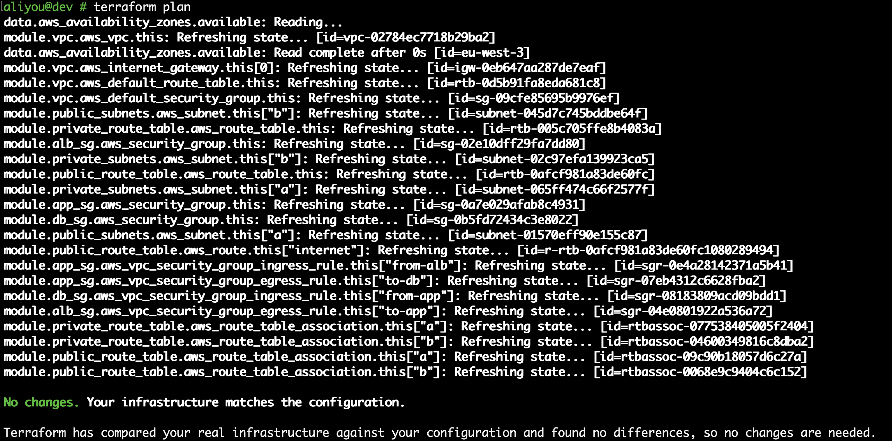
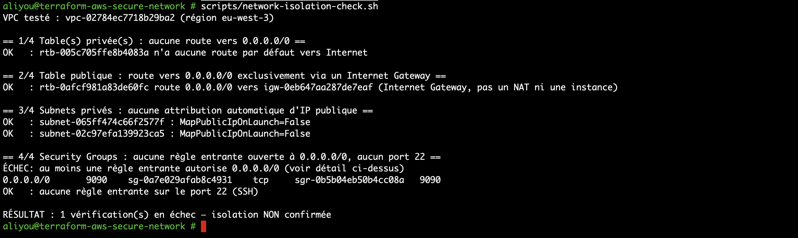

# Troubleshooting

Les scénarios ci-dessous sont soit des incidents réellement vécus pendant ce projet, soit reproduits en direct sur l'infrastructure de démonstration (`dev`), avec les commandes et sorties réellement obtenues — jamais un résultat inventé. Quand un scénario n'a pas pu être testé en conditions réelles (par exemple faute d'instance EC2, ressource payante non déployée par défaut), c'est indiqué explicitement.

## Scénario 1 : authentification OIDC en échec (incident réel, Phase 7/8)

**Contexte :** premier déploiement du workflow `terraform-plan.yml`, censé s'authentifier auprès d'AWS via OIDC.

**Symptôme :** le job échoue avec `Could not assume role with OIDC: Not authorized to perform sts:AssumeRoleWithWebIdentity`, après 12 tentatives automatiques sur ~50 secondes.

**Hypothèses envisagées :**
- ARN du rôle incorrect dans la variable de dépôt.
- Fournisseur OIDC mal configuré (empreinte de certificat, URL).
- Politique de confiance restreignant mal le dépôt ou la branche.

**Diagnostic :**
1. Vérification de la politique de confiance déployée (`aws iam get-role`) : conforme à ce qui avait été écrit.
2. Recherche dans **CloudTrail** (région `eu-west-3`, événements `AssumeRoleWithWebIdentity`, lecture seule) pour voir le claim `sub` réellement envoyé par GitHub :
   ```
   aws cloudtrail lookup-events --region eu-west-3 \
     --start-time "2026-09-22T12:05:00Z" --end-time "2026-09-22T12:20:00Z" \
     --query 'Events[?EventName==`AssumeRoleWithWebIdentity`].[EventName,EventTime,Username]' --output text
   ```
   Résultat : `repo:Aliyoub@25158336/terraform-aws-secure-network@1378078820:ref:refs/heads/main` — un format différent de celui attendu (`repo:Aliyoub/terraform-aws-secure-network:...`).
3. Confirmation via la documentation officielle GitHub : les dépôts créés après le 15/07/2026 reçoivent des identifiants immuables dans le claim `sub`. Ce dépôt a été créé le 20/09/2026.

**Root cause :** la politique de confiance IAM restreignait `sub` à un format qui ne correspondait plus au comportement réel de GitHub pour ce dépôt.

**Résolution :** ajout des identifiants immuables (`github_owner_id`, `github_repository_id`) au module `github-oidc`, `terraform apply` (0 création, 1 modification), puis nouveau run du workflow : succès.

**Prévention :** vérifier le format réel du claim `sub` (via CloudTrail ou un test manuel) avant de déployer une politique de confiance OIDC pour un nouveau dépôt, plutôt que de supposer un format documenté historiquement. Détail complet : ADR-017 dans `docs/DECISIONS.md`.

## Scénario 2 : dérive Terraform sur un tag (reproduit en direct)

**Symptôme simulé :** quelqu'un modifie un tag directement dans la console AWS, en dehors de Terraform.

**Commande de simulation :**
```
aws ec2 create-tags --region eu-west-3 --resources vpc-xxxxx \
  --tags Key=Name,Value=modifie-a-la-main-hors-terraform
```

**Diagnostic — `terraform plan` :**
```
~ resource "aws_vpc" "this" {
    ~ tags = {
        ~ "Name" = "modifie-a-la-main-hors-terraform" -> "terraform-aws-secure-network-dev-vpc"
      }
  }
Plan: 0 to add, 1 to change, 0 to destroy.
```

**Root cause :** une modification hors Terraform d'un attribut d'une ressource *suivie par le state* est détectée dès le prochain `plan`, qui la présente comme une action corrective.

**Résolution :** `terraform apply` (ré-applique la valeur du code). Revérifié propre avec un second `plan` (`No changes`).

**Prévention :** ce cas est le mieux couvert par Terraform lui-même — nul besoin d'outil supplémentaire. Le risque réel est ailleurs (scénario 3).

## Scénario 3 : ajout d'une règle dangereuse hors Terraform, invisible pour `terraform plan` (reproduit en direct)

**Symptôme simulé :** un correctif d'urgence ajoute, via la console ou l'API, une règle de Security Group non prévue par le code.

**Commande de simulation :**
```
aws ec2 authorize-security-group-ingress --region eu-west-3 \
  --group-id sg-app --protocol tcp --port 9090 --cidr 0.0.0.0/0
```

**Diagnostic — `terraform plan` :**



```
No changes. Your infrastructure matches the configuration.
```

**Ce résultat est le cœur du scénario : `terraform plan` ne voit rien.** Ce projet gère les règles de Security Group comme des ressources séparées (`aws_vpc_security_group_ingress_rule`), une par une, recommandées par le provider AWS moderne. Une règle ajoutée hors Terraform n'a aucune ressource correspondante dans le state : `plan` ne peut détecter la dérive d'une ressource qu'il ne gère pas.

**Diagnostic — `scripts/network-isolation-check.sh` :**



```
ÉCHEC: au moins une règle entrante autorise 0.0.0.0/0 (voir détail ci-dessus)
0.0.0.0/0    9090    sg-0a7e029afab8c4931    tcp    sgr-0b5b04eb50b4cc08a    9090
RÉSULTAT : 1 vérification(s) en échec — isolation NON confirmée
```

**Root cause :** `terraform plan` protège contre la dérive des ressources qu'il gère, pas contre l'apparition de nouvelles ressources qu'il ignore. Une vérification de posture de sécurité indépendante (interrogeant l'état réel du compte, pas le state Terraform) est nécessaire pour ce type de risque.

**Un défaut trouvé et corrigé dans le script lui-même :** la première version de `network-isolation-check.sh` affichait la colonne `GroupOwnerId` (l'ID de compte AWS) dans le détail des règles en échec — une fuite d'information mineure mais évitable, repérée en préparant la capture ci-dessus. Corrigé en projetant explicitement les champs affichés (`--query ...GroupId,Protocol,FromPort,ToPort,CidrIpv4,SecurityGroupRuleId`) plutôt que de laisser passer l'objet complet renvoyé par l'API.

**Résolution :** la règle n'étant pas gérée par Terraform, `terraform apply` ne l'aurait pas supprimée. Révocation manuelle :
```
aws ec2 revoke-security-group-ingress --region eu-west-3 \
  --group-id sg-app --protocol tcp --port 9090 --cidr 0.0.0.0/0
```
Revérifié propre avec `scripts/network-isolation-check.sh` (isolation confirmée) et `terraform plan` (`No changes`).

**Prévention :** exécuter `scripts/network-isolation-check.sh` régulièrement (ou en CI programmée) plutôt que de compter uniquement sur `terraform plan` pour la sécurité. C'est directement la raison d'être de ce script (Phase 9).

## Scénario 4 : suppression d'une règle légitime, invisible pour le script d'isolation (reproduit en direct)

**Symptôme simulé :** la règle qui autorise `app` à joindre `db` sur le port 5432 est supprimée par erreur.

**Commande de simulation :**
```
aws ec2 revoke-security-group-ingress --region eu-west-3 \
  --group-id sg-db --security-group-rule-ids sgr-xxxxx
```

**Diagnostic — `scripts/network-isolation-check.sh` :** ne signale rien (`RÉSULTAT : isolation public/privé confirmée`). C'est cohérent : ce script vérifie l'*absence* de règles dangereuses, pas la *présence* des règles légitimes. Une panne de connectivité applicative n'est pas un problème d'isolation.

**Diagnostic — `terraform plan` :**
```
# module.db_sg.aws_vpc_security_group_ingress_rule.this["from-app"] will be created
Plan: 1 to add, 0 to change, 0 to destroy.

Warning: AWS resource not found during refresh
```

Cette fois `terraform plan` détecte immédiatement le problème : la ressource *est* suivie par le state, mais son objet AWS a disparu. Terraform propose de la recréer.

**Root cause :** suppression manuelle d'une ressource suivie par Terraform.

**Résolution :** `terraform apply` recrée la règle. Revérifié propre.

**Prévention :** ce scénario illustre la complémentarité des deux outils : `scripts/network-isolation-check.sh` couvre la sécurité (rien de trop ouvert), `terraform plan` couvre la conformité au code (rien de manquant ou de modifié parmi les ressources suivies). Aucun des deux ne couvre l'autre.

## Scénario 5 : subnet privé sans route vers Internet — impact sur un subnet public (reproduit en direct)

**Symptôme simulé :** la route par défaut du subnet public vers l'Internet Gateway est supprimée (fausse manipulation, ou automatisation buguée).

**Commande de simulation :**
```
aws ec2 delete-route --region eu-west-3 \
  --route-table-id rtb-public --destination-cidr-block 0.0.0.0/0
```

**Diagnostic — `scripts/network-isolation-check.sh` :**
```
== 2/4 Table publique : route vers 0.0.0.0/0 exclusivement via un Internet Gateway ==
ÉCHEC: rtb-public n'a pas de route 0.0.0.0/0 valide vers un Internet Gateway (trouvé : 'aucune')
```

**Diagnostic — `terraform plan` :**
```
# module.public_route_table.aws_route.this["internet"] will be created
Plan: 1 to add, 0 to change, 0 to destroy.
```

**Root cause :** la route étant une ressource Terraform à part entière (`aws_route`), sa suppression est détectée par les deux outils simultanément : c'est à la fois une non-conformité au code et une perte d'isolation fonctionnelle (plus aucune ressource publique n'est joignable).

**Résolution :** `terraform apply`. Revérifié propre avec les deux outils.

**Prévention :** documenter clairement, comme dans `ARCHITECTURE.md`, que le caractère public d'un subnet dépend entièrement de cette route unique : sa suppression accidentelle est un scénario crédible et son impact est immédiat.

## Scénario 6 : ressource publique inaccessible malgré une configuration correcte

**Toujours non testé avec ce scénario précis.** La Phase 11 a bien déployé une instance EC2 réelle (voir `docs/EXTENSIONS.md`), mais dans un **subnet privé**, exposée uniquement via un ALB — jamais une instance dans un subnet public avec IP publique directe, qui est le scénario exact décrit ici. Il reste donc présenté comme un raisonnement structuré à partir de la configuration réelle de ce projet, utile en entretien, plutôt que comme un test réellement exécuté.

**Symptôme hypothétique :** une instance dans un subnet public, avec une IP publique attribuée, reste injoignable en HTTPS depuis Internet.

**Démarche de diagnostic, dans l'ordre des trois couches qui se cumulent (voir `docs/ARCHITECTURE.md`) :**

1. **Routage :** le subnet est-il associé à une table avec une route `0.0.0.0/0 → igw-...` ? (`aws ec2 describe-route-tables`, comme aux scénarios 3 et 5). Si absente, aucune ressource du subnet n'est joignable, quelle que soit sa configuration.
2. **Adressage :** l'instance a-t-elle une IP publique ou une Elastic IP effectivement associée ? (`aws ec2 describe-instances --query 'Reservations[].Instances[].PublicIpAddress'`). Rappel : `map_public_ip_on_launch` est désactivé par défaut dans ce projet (ADR-006) — une IP publique doit être demandée explicitement.
3. **Security Group :** une règle entrante autorise-t-elle le port et la source attendus ? (`aws ec2 describe-security-group-rules`). Dans ce projet, le groupe `alb` n'autorise rien par défaut (`alb_allowed_https_cidrs` vide) : une exposition publique est un acte explicite, jamais accidentel.
4. **Network ACL :** la NACL par défaut du subnet autorise-t-elle le trafic entrant et sortant sur les ports éphémères ? Non personnalisée dans ce projet (ADR-012), donc rarement la cause ici — mais à vérifier en priorité si une NACL personnalisée existait.
5. **Système d'exploitation :** un pare-feu interne (`iptables`, `firewalld`) ou le service lui-même peut bloquer, hors du périmètre réseau AWS.

**Root cause type :** dans l'immense majorité des cas réels, l'une des trois premières couches. Diagnostiquer dans cet ordre (routage → adressage → Security Group) va du plus large au plus spécifique et évite de chercher un problème applicatif avant d'avoir écarté le réseau.

**Prévention :** les trois couches sont vérifiables sans coût par script (comme `scripts/network-isolation-check.sh`), avant même de solliciter l'équipe applicative.
